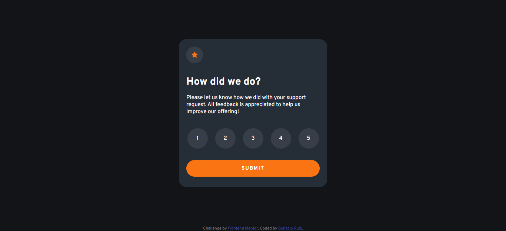

# Frontend Mentor - Interactive rating component

Esta es mi solución al  [challenge de componente "Interactive rating" de Frontend Mentor](https://www.frontendmentor.io/challenges/interactive-rating-component-koxpeBUmI).

### Los/as usuarios/as deberían ser capaces de

- Ver el layout correspondiente según el tamaño de pantalla de su dispositivo.
- Ver estilos especiales (hover) para todos los elementos interactivos en la página.
- Seleccionar y enviar una calificación numérica.
- Ver la carta de agradecimiento una vez envíen su puntuación.

- Solution URL: [URL del challenge en GitHub](https://github.com/Gon-Dev/interactive-rating-component)
- Live Site URL: [Challenge online funcionando](https://gon-dev.github.io/interactive-rating-component/)

### Armado con las siguientes tecnologías

- HTML 5
- CSS 3
- Flexbox
- CSS Grid
- Vanilla Javascript

### ¿Qué aprendí?

Gracias a este challenge conseguí poner en práctica conceptos como:

- CSS: Flexbox
- CSS: Grid
- JS: Manipulación del DOM
- JS: Event Listeners

## Agradecimientos

- Frontend Mentor - [@yourusername](https://www.frontendmentor.io/profile/Gon-Dev)
- Wes Bos - [@wesbos](https://wesbos.com/)
